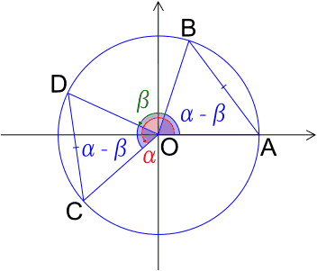
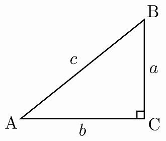

# Multiplication of complex numbers in trigonometric form proof

```math
z_1z_2 = |z_1|(\cos(\theta_1) + i\sin(\theta_1))|z_2|(\cos(\theta_2) + i\sin(\theta_2))
```
```math
|z_1||z_2|(\cos(\theta_1)\cos(\theta_2) + i\cos(\theta_1)\sin(\theta_2) + i\sin(\theta_1)\cos(\theta_2) - \sin(\theta_1)\sin(\theta_2))
```
```math
|z_1||z_2|(\cos(\theta_1)\cos(\theta_2) - \sin(\theta_1)\sin(\theta_2) + i(\cos(\theta_1)\sin(\theta_2) + \sin(\theta_1)\cos(\theta_2)))
```

#### Theorem

```math
\boxed{\cos(\theta_1 + \theta_2) = \cos(\theta_1)\cos(\theta_2) - \sin(\theta_1)\sin(\theta_2)}
```
```math
\sin(\theta_1 + \theta_2) = \sin(\theta_1)\cos(\theta_2) + \cos(\theta_1)\sin(\theta_2)
```

#### Proof

Consider the following picture.

<p align="center">
  
</p>

We have

```math
A\hat{O}C = \alpha
```
```math
A\hat{O}D = \beta
```
```math
C\hat{O}D = \alpha - \beta
```

and

```math
A = (\cos(0), \sin(0)) = (1, 0)
```
```math
B = (\cos(\alpha - \beta), \sin(\alpha - \beta))
```
```math
C = (\cos(\alpha), \sin(\alpha))
```
```math
D = (\cos(\beta), \sin(\beta))
```

Here I want to open a little parenthesis on $A$. I specified $A = (\cos(0), \sin(0))$ because this theorem is built on $\sin$ and $\cos$ relations and the previous picture where $A$ sits on $(1, 0)$ could be misleading. This is because this theorem is not related with the length of the radius, that is, it works for any radius, hence the hypothesis of $r = 1$, doesn't really exist, that is, it just turns out that the previous picture represents the problem and $A = (\cos(0), \sin(0)) = (1, 0)$ always, and not because it is an hypothesis.

Since

```math
A\hat{O}B = C\hat{O}D = \alpha - \beta
```
```math
\overline{AB} = \overline{CD}
```

and

```math
\overline{AB} = \sqrt{(\cos(\alpha - \beta) - 1)^{2} + (\sin(\alpha - \beta) - 0)^{2}}
```
```math
\overline{CD} = \sqrt{(\cos(\alpha) - \cos(\beta))^{2} + (\sin(\alpha) - \sin(\beta))^{2}}
```

where the last two formulas are just the basic formula to compute the distance between two points in the cartesian graph (note that the order of minuend and subtrahend doesn't matter since the difference is squared). Now since $\overline{AB} = \overline{CD}$

```math
\sqrt{(\cos(\alpha - \beta) - 1)^{2} + (\sin(\alpha - \beta) - 0)^{2}} = \sqrt{(\cos(\alpha) - \cos(\beta))^{2} + (\sin(\alpha) - \sin(\beta))^{2}}
```
```math
(\cos(\alpha - \beta) - 1)^{2} + (\sin(\alpha - \beta) - 0)^{2} = (\cos(\alpha) - \cos(\beta))^{2} + (\sin(\alpha) - \sin(\beta))^{2}
```
```math
\cos^{2}(\alpha - \beta) - 2\cos(\alpha - \beta) + 1 + \sin^{2}(\alpha - \beta) = \cos^{2}(\alpha) - 2\cos(\alpha)\cos(\beta) + \cos^{2}(\beta) + \sin^{2}(\alpha) - 2\sin(\alpha)\sin(\beta) + \sin^{2}(\beta)
```

Now we need to further analyze the fundamental relation of trigonometry.

#### Theorem

```math
\cos^{2}(\theta) + \sin^{2}(\theta) = 1
```

#### Proof

Let $ABC$ be a right triangle with hypothenuse $\overline{AB}$ and right angle $A\hat{C}B$.

<p align="center">
  
</p>

The only subtle intuition is to understand that

```math
\displaystyle \sin(B\hat{A}C) = \frac{\overline{BC}}{\overline{AB}}
```

and not just $\overline{BC}$. It could be strange at first because in general we are used to reason on a circumference of radius $1$ where $\sin(B\hat{A}C)$ would be exactly $\overline{BC}$, but the truth is that $\sin$ and $\cos$ are relations between quantities (in this case lengths), indeed $\sin(B\hat{A}C) = 1$ only if the length of the segment we identified as $\overline{BC}$ is equal to $\overline{AB}$ (which would destroy the structure of the triangle but that's not the point here, indeed $\sin(90°)$ still equals $1$ after this revelation), and when we reason having a radius which equals $1$, we have

```math
\displaystyle \sin(B\hat{A}C) = \frac{\overline{BC}}{1} = \overline{BC}
```

which clarifies why this theorem could be strange at first. We have

```math
\displaystyle \sin(B\hat{A}C) = \frac{\overline{BC}}{\overline{AB}}
```
```math
\displaystyle \cos(B\hat{A}C) = \frac{\overline{AC}}{\overline{AB}}
```

then

```math
\displaystyle \sin^2(B\hat{A}C) = \frac{\overline{BC}^2}{\overline{AB}^2}
```
```math
\displaystyle \cos^2(B\hat{A}C) = \frac{\overline{AC}^2}{\overline{AB}^2}
```
```math
\displaystyle \sin^2(B\hat{A}C) + \cos^2(B\hat{A}C) = \frac{\overline{BC}^2}{\overline{AB}^2} + \frac{\overline{AC}^2}{\overline{AB}^2} = \frac{\overline{BC}^2 + \overline{AC}^2}{\overline{AB}^2}
```

and by the Pythagorean Theorem we exactly have that

```math
\overline{BC}^2 + \overline{AC}^2 = \overline{AB}^2
```

then

```math
\displaystyle \frac{\overline{BC}^2 + \overline{AC}^2}{\overline{AB}^2} = 1
```

and therefore

```math
\cos^{2}(\theta) + \sin^{2}(\theta) = 1
```

always, for any $\theta$ $\square$.

Back to our previous theorem we had

```math
\cos^{2}(\alpha - \beta) - 2\cos(\alpha - \beta) + 1 + \sin^{2}(\alpha - \beta) = \cos^{2}(\alpha) - 2\cos(\alpha)\cos(\beta) + \cos^{2}(\beta) + \sin^{2}(\alpha) - 2\sin(\alpha)\sin(\beta) + \sin^{2}(\beta)
```

then by the fundamental relation of trigonometry we have

```math
\cos^{2}(\alpha - \beta) + \sin^{2}(\alpha - \beta) = 1
```
```math
\cos^{2}(\alpha) + \sin^{2}(\alpha) = 1
```
```math
\cos^{2}(\beta) + \sin^{2}(\beta) = 1
```

thus

```math
\cos^{2}(\alpha - \beta) - 2\cos(\alpha - \beta) + 1 + \sin^{2}(\alpha - \beta) = \cos^{2}(\alpha) - 2\cos(\alpha)\cos(\beta) + \cos^{2}(\beta) + \sin^{2}(\alpha) - 2\sin(\alpha)\sin(\beta) + \sin^{2}(\beta)
```
```math
2 - 2\cos(\alpha - \beta) = - 2\cos(\alpha)\cos(\beta) - 2\sin(\alpha)\sin(\beta) + 2
```
```math
2\cos(\alpha - \beta) = 2\cos(\alpha)\cos(\beta) + 2\sin(\alpha)\sin(\beta)
```
```math
\cos(\alpha - \beta) = \cos(\alpha)\cos(\beta) + \sin(\alpha)\sin(\beta)
```

Now

```math
\cos(\alpha + \beta) = \cos(\alpha - (- \beta))
```
```math
\cos(\alpha - (- \beta)) = \cos(\alpha)\cos(- \beta) + \sin(\alpha)\sin(- \beta)
```

Now it's quite simple to see that

```math
\cos(- \beta) = \cos(\beta)
```
```math
\sin(- \beta) = - \sin(\beta)
```

then

```math
\cos(\alpha - (- \beta)) = \cos(\alpha)\cos(- \beta) + \sin(\alpha)\sin(- \beta)
```
```math
\cos(\alpha + \beta) = \cos(\alpha)\cos(\beta) - \sin(\alpha)\sin(\beta)
```

which finally proves the first formula of the theorem.

Let's prove the second one $(\sin(\alpha + \beta) = \sin(\alpha)\cos(\beta) + \cos(\alpha)\sin(\beta))$.

```math
\cos(\alpha - \beta) = \cos(\alpha)\cos(\beta) + \sin(\alpha)\sin(\beta)
```
```math
--
```
```math
\alpha = 90° - \alpha
```
```math
--
```
```math
\cos((90° - \alpha) - \beta) = \cos(90° - \alpha)\cos(\beta) + \sin(90° - \alpha)\sin(\beta)
```
```math
--
```
```math
\cos((90° - \alpha) - \beta) = \cos(90° - \alpha - \beta) = \cos(90° - (\alpha + \beta)) = \sin(\alpha + \beta)
```
```math
--
```
```math
\sin(\alpha + \beta) = \cos(90° - \alpha)\cos(\beta) + \sin(90° - \alpha)\sin(\beta)
```
```math
\sin(\alpha + \beta) = \sin(\alpha)\cos(\beta) + \cos(\alpha)\sin(\beta)
```
```math
\square
```

Now we can finally reconnect with the complex multiplication. We had

```math
|z_1||z_2|(\cos(\theta_1)\cos(\theta_2) - \sin(\theta_1)\sin(\theta_2) + i(\cos(\theta_1)\sin(\theta_2) + \sin(\theta_1)\cos(\theta_2)))
```

Since now we know that

```math
\cos(\alpha + \beta) = \cos(\alpha)\cos(\beta) - \sin(\alpha)\sin(\beta)
```
```math
and
```
```math
\sin(\alpha + \beta) = \sin(\alpha)\cos(\beta) + \cos(\alpha)\sin(\beta)
```
```math
then
```
```math
z_1z_2 = |z_1||z_2|(\cos(\theta_1)\cos(\theta_2) - \sin(\theta_1)\sin(\theta_2) + i(\cos(\theta_1)\sin(\theta_2) + \sin(\theta_1)\cos(\theta_2)))
```
```math
|z_1||z_2|(\cos(\theta_1 + \theta_2) + i\sin(\theta_1 + \theta_2))
```
