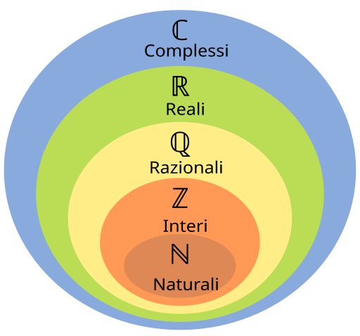
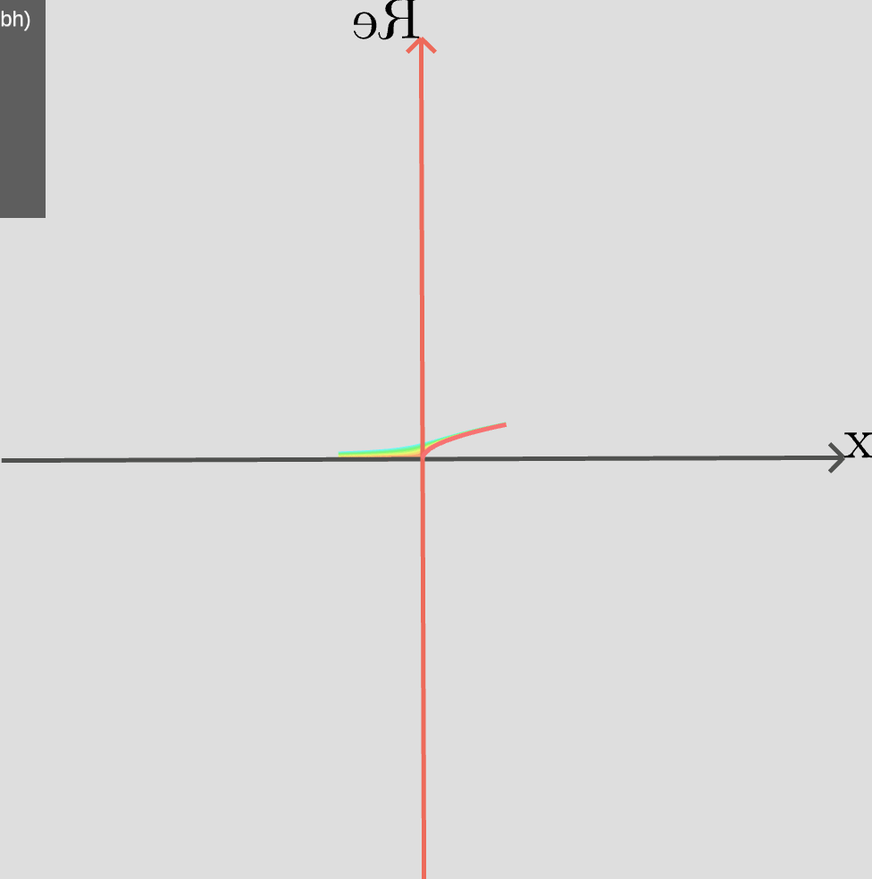
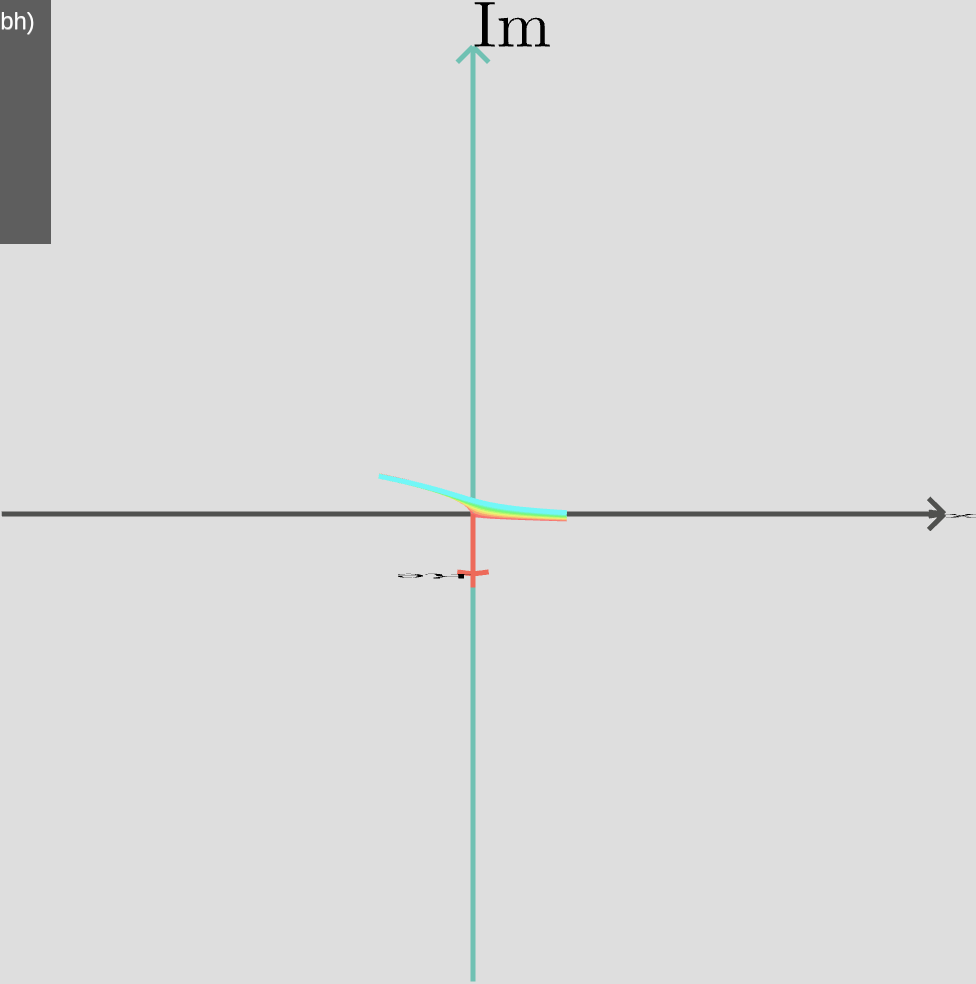
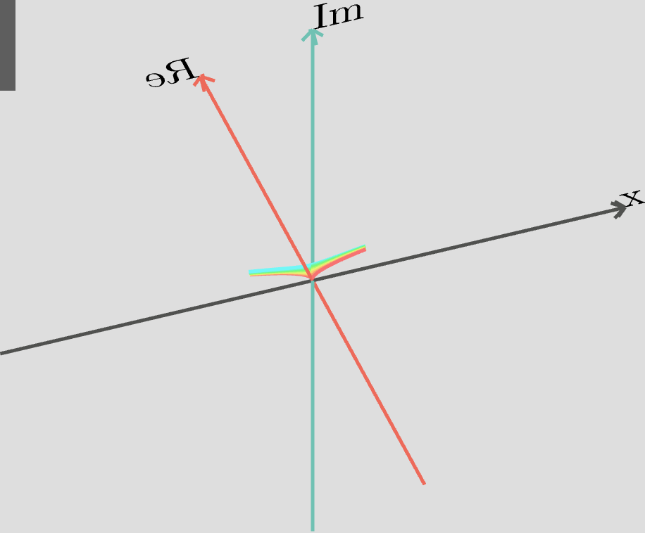
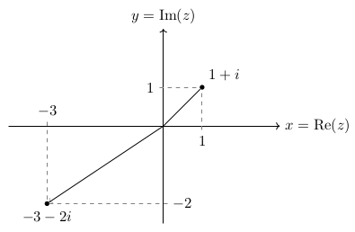
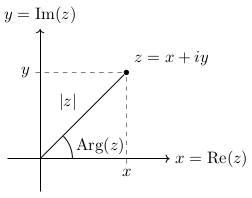
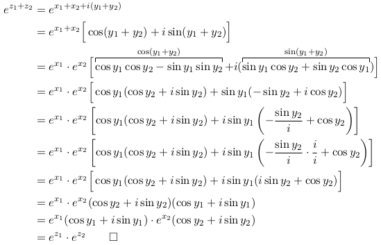
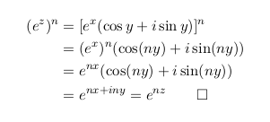
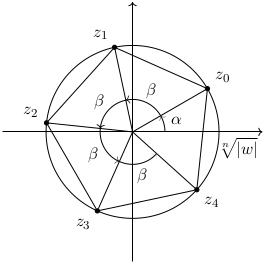

# Complex numbers background

Complex numbers are a necessary part of math allowing a solution to equations of the form

```math
x = \sqrt{- n} \notin R
```
```math
x = \sqrt{- n} = i\sqrt{n} = Im(\sqrt{n}) \in C
```

where $n > 0 \in R$.
  
Since this calculation doesn't follow $R$ field rules, another field is necessary to operate on these numbers, and guess what it's the complex field $C$. We don't care about every single property of a field, what I want to say now is that basic operations in $C$ behave differently compared to $R$. The interesting fact is that the equation above alone builds an entire field around itself.<br>
Now, before we proceed, I want to clarify one thing: the complex field is often associated to the $3rd$ dimension of the cartesian graph. There exist some tools [https://hemisemidemipresent.github.io/complex/] which help figuring out the three-dimensionality built by the complex field, since it coexist with the two-dimensional cartesian graph $/R$ field (they share the $x - axis$). But note that this doesn't necessarily mean that we are talking about dimensions. As humans we are dependent on visualize things graphically, but math is nothing but logic relations about quantities. If you think about the $C$ field as "another dimension" you are probably not right. Indeed $C$ **extends** $R$, and allows to operate on complex numbers, nothing more, nothing less. To conclude, don't stick too much on the dimensions, even though having a look at the above link could be useful.

<p align="center">
  
</p>

## Representation and multiplication of numbers in $C$

Since

```math
n > 0, \sqrt{- n} = i\sqrt{n}
```
```math
(\sqrt{- n})^{2} = - n = (i\sqrt{n})^{2} = i^{2}(\sqrt{n})^{2}
```

it must be that

```math
i^{2} = i \cdot i = - 1
```

and

```math
\sqrt{- 1} = i\sqrt{1} = i
```

When we deal with the cartesian graph, every point mapped on it can be represented using this form:

```math
(x, y)
```

We can notice that this representation is the same as $x + y$ because it identifies a point uniquely, indeed, this form is called "algebraic". Now since (as already mentioned) $C$ field shares $x-axis$ with $R$, we can represent complex numbers as sitting on an orthogonal to $R$ plane (see the link above and play around, this is why I told you that it could be useful to visualize it). This reasoning is to "justify" the presence of a "real" part in the $C$ field (even though the real reason should be found by directly looking at the algebraic formula of an **impure** complex number $x + iy$). To better understand this fact, the following are the 2D (Re, and Im) **and** 3D representation of $y = \sqrt{x}$ function

<p align="center">
  
</p>

which as you can see is not defined when $n < 0$ since $\sqrt{n} \notin R$ for $n$ negative, while

<p align="center">
  
</p>

is exactly the same function but it is defined in $C$, indeed $n < 0, \sqrt{n} = i\sqrt{n} \in C$.<br>
Now let's see the 3D representation, always noting that these results are somehow biased from the obvious complexity of such 
software and the forced $3rd-person$ POV.

<p align="center">
  
</p>

Now, since we know why the $x-axis$ is shared between $R$ and $C$, and we can represent any number in an "algebraic" form, then

```math
z = (x, y) \sim x + y
```

with $z, x, y \in R$, is the representation of any number on the $R-plane$ part of the cartesian graph, while

```math
z = (x, Im(y)) \sim x + Im(y)
```

with $z, Im(y) \in C, x, y \in R$, is the representation of any number on the $C-plane$ part of the cartesian graph.

Now we can further observe a couple of complex numbers graphical representation in a clearer representation of the $C$ plane.

```math
z_1 = 1 + Im(1)
```
```math
z_2 = - 3 - Im(2)
```

<p align="center">
  
</p>

Now we can finally see the multiplication.

```math
z_{1} = (x_{1}, Im(y_{1})) = x_{1} + Im(y_{1}) = x_{1} + iy_{1}
```
```math
z_{2} = (x_{2}, Im(y_{2})) = x_{2} + Im(y_{2}) = x_{2} + iy_{2}
```
```math
(x_{1}, Im(y_{1})) \cdot (x_{2}, Im(y_{2})) = (x_{1} + iy_{1})(x_{2} + iy_{2}) = x_{1}x_{2} + x_{1}iy_{2} + iy_{1}x_{2} + (- 1)y_{1}y_{2} = x_{1}x_{2} - y_{1}y_{2} + i(x_{1}y_{2} + y_{1}x_{2}) = (x_{1}x_{2} - y_{1}y_{2}, x_{1}y_{2} + y_{1}x_{2})
```

## Complex divison using algebraic form

We can make a little trick to avoid $i$ in the denominator and have a more readable general form for divison.

```math
\displaystyle \frac{z_1}{z_2} = \frac{x_1 + iy_1}{x_2 + iy_2} = \frac{x_1 + iy_1}{x_2 + iy_2} \cdot \frac{x_2 - iy_2}{x_2 - iy_2} = \frac{(x_1 + iy_1)(x_2 - iy_2)}{x_2^2 + y_2^2} = \frac{x_1x_2 + y_1y_2 + i(x_2y_1 - x_1y_2)}{x_2^2 + y_2^2} = \frac{x_1x_2 + y_1y_2}{x_2^2 + y_2^2} + i\frac{x_2y_1 - x_1y_2}{x_2^2 + y_2^2}
```

## Tigonometric form of complex numbers

Some basic knowledge of trigonometry enables us to represent complex numbers in a quite intuitive form which only involves the length of $z$ segment, and the $\sin$ and $\cos$ functions, which in turn is the exact same of the "algebraic" form.

If you don't remember radians values for angles I give you a quick remainder. The circumference of a circle of radius $r = 1$ is given by

```math
C = 2 \pi r
```

(because $\pi = C / 2r$).

This means that we can represent the round angle ($360°$) $\theta$ as $(r = 1)$

```math
\theta = 2\pi
```

and every other angle follows, then if

```math
\theta = 180°, \theta = \pi
```
```math
\theta = 90°, \displaystyle \theta = \frac{\pi}{2}
```

and so on.

Now, back to our complex numbers, since

```math
z = x + Im(y) = x + iy
```
  
we can define $z \in C$ as

```math
z = \sqrt{x^{2} + y^{2}}\cos(\theta) + \sqrt{x^{2} + y^{2}}i\sin(\theta)
```

where $\theta$ is the angle in the middle of the $z$ segment and the $x-axis$, and $\sqrt{x^{2} + y^{2}}$ is basically the formula derived from the Pythagorean Theorem which calculates the hypothenuse of a triangle, which in our case is exactly the $z$ segment (and for which you can find an intuitive graphical proof at [https://it.wikipedia.org/wiki/Teorema_di_Pitagora] just watching the images). Now, calling

```math
|z| = \sqrt{x^{2} + y^{2}}
```
```math
z = |z|\cos(\theta) + |z|i\sin(\theta)
```
```math
z = |z|(\cos(\theta) + i\sin(\theta))
```

we basically derived our trigonometric form for any complex number $z$, for which you can find a graphical representation below.

<p align="center">
  
</p>

Since angles repeat themselves with a period of $k(2\pi), k \in Z$ we have that

```math
z_1 = z_2 \iff |z_1| = |z_2|
```
```math
\wedge
```
```math
\theta_1 = \theta_2 + k(2\pi), k \in Z
```

## Trigonometric multiplication

```math
z_1z_2 = |z_1|(\cos(\theta_1) + i\sin(\theta_1))|z_2|(\cos(\theta_2) + i\sin(\theta_2))
```
```math
|z_1||z_2|(\cos(\theta_1)\cos(\theta_2) + i\cos(\theta_1)\sin(\theta_2) + i\sin(\theta_1)\cos(\theta_2) - \sin(\theta_1)\sin(\theta_2))
```
```math
|z_1||z_2|(\cos(\theta_1)\cos(\theta_2) - \sin(\theta_1)\sin(\theta_2) + i(\cos(\theta_1)\sin(\theta_2) + \sin(\theta_1)\cos(\theta_2)))
```

Now we need to make a deviation into trigonometry in order to further simplify this last equation.

#### Theorem

```math
\boxed{\cos(\theta_1 + \theta_2) = \cos(\theta_1)\cos(\theta_2) - \sin(\theta_1)\sin(\theta_2)}
```
```math
\sin(\theta_1 + \theta_2) = \sin(\theta_1)\cos(\theta_2) + \cos(\theta_1)\sin(\theta_2)
```

#### Proof

Consider the following picture.

<p align="center">
  
</p>

We have

```math
A\hat{O}C = \alpha
```
```math
A\hat{O}D = \beta
```
```math
C\hat{O}D = \alpha - \beta
```

and

```math
A = (\cos(0), \sin(0)) = (1, 0)
```
```math
B = (\cos(\alpha - \beta), \sin(\alpha - \beta))
```
```math
C = (\cos(\alpha), \sin(\alpha))
```
```math
D = (\cos(\beta), \sin(\beta))
```

Here I want to open a little parenthesis on $A$. I specified $A = (\cos(0), \sin(0))$ because this theorem is built on $\sin$ and $\cos$ relations and the previous picture where $A$ sits on $(1, 0)$ could be misleading. This is because this theorem is not related with the length of the radius, that is, it works for any radius, hence the hypothesis of $r = 1$, doesn't really exist, that is, it just turns out that the previous picture represents the problem and $A = (\cos(0), \sin(0)) = (1, 0)$ always, and not because it is an hypothesis.

Since

```math
A\hat{O}B = C\hat{O}D = \alpha - \beta
```
```math
\overline{AB} = \overline{CD}
```

and

```math
\overline{AB} = \sqrt{(\cos(\alpha - \beta) - 1)^{2} + (\sin(\alpha - \beta) - 0)^{2}}
```
```math
\overline{CD} = \sqrt{(\cos(\alpha) - \cos(\beta))^{2} + (\sin(\alpha) - \sin(\beta))^{2}}
```

where the last two formulas are just the basic formula to compute the distance between two points in the cartesian graph (note that the order of minuend and subtrahend doesn't matter since the difference is squared). Now since $\overline{AB} = \overline{CD}$

```math
\sqrt{(\cos(\alpha - \beta) - 1)^{2} + (\sin(\alpha - \beta) - 0)^{2}} = \sqrt{(\cos(\alpha) - \cos(\beta))^{2} + (\sin(\alpha) - \sin(\beta))^{2}}
```
```math
(\cos(\alpha - \beta) - 1)^{2} + (\sin(\alpha - \beta) - 0)^{2} = (\cos(\alpha) - \cos(\beta))^{2} + (\sin(\alpha) - \sin(\beta))^{2}
```
```math
\cos^{2}(\alpha - \beta) - 2\cos(\alpha - \beta) + 1 + \sin^{2}(\alpha - \beta) = \cos^{2}(\alpha) - 2\cos(\alpha)\cos(\beta) + \cos^{2}(\beta) + \sin^{2}(\alpha) - 2\sin(\alpha)\sin(\beta) + \sin^{2}(\beta)
```

Now we need to further analyze the fundamental relation of trigonometry.

#### Theorem

```math
\cos^{2}(\theta) + \sin^{2}(\theta) = 1
```

#### Proof

Let $ABC$ be a right triangle with hypothenuse $\overline{AB}$ and right angle $A\hat{C}B$.

<p align="center">
  
</p>

The only subtle intuition is to understand that

```math
\displaystyle \sin(B\hat{A}C) = \frac{\overline{BC}}{\overline{AB}}
```

and not just $\overline{BC}$. It could be strange at first because in general we are used to reason on a circumference of radius $1$ where $\sin(B\hat{A}C)$ would be exactly $\overline{BC}$, but the truth is that $\sin$ and $\cos$ are relations between quantities (in this case lengths), indeed $\sin(B\hat{A}C) = 1$ only if the length of the segment we identified as $\overline{BC}$ is equal to $\overline{AB}$ (which would destroy the structure of the triangle but that's not the point here, indeed $\sin(90°)$ still equals $1$ after this revelation), and when we reason having a radius which equals $1$, we have

```math
\displaystyle \sin(B\hat{A}C) = \frac{\overline{BC}}{1} = \overline{BC}
```

which clarifies why this theorem could be strange at first. We have

```math
\displaystyle \sin(B\hat{A}C) = \frac{\overline{BC}}{\overline{AB}}
```
```math
\displaystyle \cos(B\hat{A}C) = \frac{\overline{AC}}{\overline{AB}}
```

then

```math
\displaystyle \sin^2(B\hat{A}C) = \frac{\overline{BC}^2}{\overline{AB}^2}
```
```math
\displaystyle \cos^2(B\hat{A}C) = \frac{\overline{AC}^2}{\overline{AB}^2}
```
```math
\displaystyle \sin^2(B\hat{A}C) + \cos^2(B\hat{A}C) = \frac{\overline{BC}^2}{\overline{AB}^2} + \frac{\overline{AC}^2}{\overline{AB}^2} = \frac{\overline{BC}^2 + \overline{AC}^2}{\overline{AB}^2}
```

and by the Pythagorean Theorem we exactly have that

```math
\overline{BC}^2 + \overline{AC}^2 = \overline{AB}^2
```

then

```math
\displaystyle \frac{\overline{BC}^2 + \overline{AC}^2}{\overline{AB}^2} = 1
```

and therefore

```math
\cos^{2}(\theta) + \sin^{2}(\theta) = 1
```

always, for any $\theta$ $\square$.

Back to our previous theorem we had

```math
\cos^{2}(\alpha - \beta) - 2\cos(\alpha - \beta) + 1 + \sin^{2}(\alpha - \beta) = \cos^{2}(\alpha) - 2\cos(\alpha)\cos(\beta) + \cos^{2}(\beta) + \sin^{2}(\alpha) - 2\sin(\alpha)\sin(\beta) + \sin^{2}(\beta)
```

then by the fundamental relation of trigonometry we have

```math
\cos^{2}(\alpha - \beta) + \sin^{2}(\alpha - \beta) = 1
```
```math
\cos^{2}(\alpha) + \sin^{2}(\alpha) = 1
```
```math
\cos^{2}(\beta) + \sin^{2}(\beta) = 1
```

thus

```math
\cos^{2}(\alpha - \beta) - 2\cos(\alpha - \beta) + 1 + \sin^{2}(\alpha - \beta) = \cos^{2}(\alpha) - 2\cos(\alpha)\cos(\beta) + \cos^{2}(\beta) + \sin^{2}(\alpha) - 2\sin(\alpha)\sin(\beta) + \sin^{2}(\beta)
```
```math
2 - 2\cos(\alpha - \beta) = - 2\cos(\alpha)\cos(\beta) - 2\sin(\alpha)\sin(\beta) + 2
```
```math
2\cos(\alpha - \beta) = 2\cos(\alpha)\cos(\beta) + 2\sin(\alpha)\sin(\beta)
```
```math
\cos(\alpha - \beta) = \cos(\alpha)\cos(\beta) + \sin(\alpha)\sin(\beta)
```

Now

```math
\cos(\alpha + \beta) = \cos(\alpha - (- \beta))
```
```math
\cos(\alpha - (- \beta)) = \cos(\alpha)\cos(- \beta) + \sin(\alpha)\sin(- \beta)
```

Now it's quite simple to see that

```math
\cos(- \beta) = \cos(\beta)
```
```math
\sin(- \beta) = - \sin(\beta)
```

then

```math
\cos(\alpha - (- \beta)) = \cos(\alpha)\cos(- \beta) + \sin(\alpha)\sin(- \beta)
```
```math
\cos(\alpha + \beta) = \cos(\alpha)\cos(\beta) - \sin(\alpha)\sin(\beta)
```

which finally proves the first formula of the theorem.

Let's prove the second one $(\sin(\alpha + \beta) = \sin(\alpha)\cos(\beta) + \cos(\alpha)\sin(\beta))$.

```math
\cos(\alpha - \beta) = \cos(\alpha)\cos(\beta) + \sin(\alpha)\sin(\beta)
```
```math
--
```
```math
\alpha = 90° - \alpha
```
```math
--
```
```math
\cos((90° - \alpha) - \beta) = \cos(90° - \alpha)\cos(\beta) + \sin(90° - \alpha)\sin(\beta)
```
```math
--
```
```math
\cos((90° - \alpha) - \beta) = \cos(90° - \alpha - \beta) = \cos(90° - (\alpha + \beta)) = \sin(\alpha + \beta)
```
```math
--
```
```math
\sin(\alpha + \beta) = \cos(90° - \alpha)\cos(\beta) + \sin(90° - \alpha)\sin(\beta)
```
```math
\sin(\alpha + \beta) = \sin(\alpha)\cos(\beta) + \cos(\alpha)\sin(\beta)
```
```math
\square
```

Now we can finally reconnect with the complex multiplication. We had

```math
|z_1||z_2|(\cos(\theta_1)\cos(\theta_2) - \sin(\theta_1)\sin(\theta_2) + i(\cos(\theta_1)\sin(\theta_2) + \sin(\theta_1)\cos(\theta_2)))
```

Since now we know that

```math
\cos(\alpha + \beta) = \cos(\alpha)\cos(\beta) - \sin(\alpha)\sin(\beta)
```
```math
and
```
```math
\sin(\alpha + \beta) = \sin(\alpha)\cos(\beta) + \cos(\alpha)\sin(\beta)
```
```math
then
```
```math
z_1z_2 = |z_1||z_2|(\cos(\theta_1)\cos(\theta_2) - \sin(\theta_1)\sin(\theta_2) + i(\cos(\theta_1)\sin(\theta_2) + \sin(\theta_1)\cos(\theta_2)))
```
```math
|z_1||z_2|(\cos(\theta_1 + \theta_2) + i\sin(\theta_1 + \theta_2))
```

## Trigonometric divison

We recycle the previous result and state that if

```math
z = z_1 / z_2
```
```math
zz_2 = z_1
```

then

```math
|z||z_2|(\cos(\theta + \theta_2) + i\sin(\theta + \theta_2)) = |z_1|(\cos(\theta_1) + i\sin(\theta_1))
```
```math
\displaystyle |z| = \frac{|z_1|}{|z_2|}
```
```math
and
```
```math
\cos(\theta + \theta_2) + i\sin(\theta + \theta_2) = \cos(\theta_1) + i\sin(\theta_1)
```
```math
\cos(\theta + \theta_2 - \theta_2) + i\sin(\theta + \theta_2 - \theta_2) = \cos(\theta_1 - \theta_2) + i\sin(\theta_1 - \theta_2)
```
```math
\cos(\theta) + i\sin(\theta) = \cos(\theta_1 - \theta_2) + i\sin(\theta_1 - \theta_2)
```
```math
\displaystyle z = \frac{z_1}{z_2} = \frac{|z_1|}{|z_2|}(\cos(\theta_1 - \theta_2) + i\sin(\theta_1 - \theta_2))
```

## Trigonometric powers

It's quite trivial now to see that

```math
z^{n} = |z|^{n}(\cos(n\theta) + i\sin(n\theta))
```

## De Moivre formula

When $|z| = 1$ we have De Moivre formula defined as

```math
z^{n} = \cos(n\theta) + i\sin(n\theta)
```

## From Newton $e$ constant discovery to Euler Identity

Long time ago Newton faced the topic of derivatives and wanted to find a function whose derivative was equivalent to itself. Since polynomials gets downgraded by derivatives it couldn't be a normal polynomial, but what about an infinite polynomial which approximates the function? Now, accidentally, every function which has infinite many derivatives can be approximated towards perfection in a point $x_0$ through an infinite polynomial which is called Taylor series, which is defined as

```math
\displaystyle \sum_{n = 0}^{\infty} \frac{f^{(n)}(x_0)}{n!}(x - x_0)^{n}
```

where $f^{(n)}(x_0)$ represents the $nth$ derivative of $f(x)$ calculated in $x_0$. I won't derive the series from scratch since there are no ways to make it a fast process [https://math.stackexchange.com/questions/706282/how-are-the-taylor-series-derived], but we can think of the Taylor series as a polynomial which approximates $f(x)$ centered in $x_0$ better and better the more addends we consider, that is, the more derivatives we consider of the function. If we have a function which has infinite many derivatives then the Taylor series will exactly be that function. Now, if we consider the point $x_0 = 0$ (which is fine as long as our function is defined in $x = 0$) we get the same result of the previous function, fixing the center of the approximation in $x = 0$ which is fine, and obtaining 

```math
\displaystyle \sum_{n = 0}^{\infty} \frac{f^{(n)}(0)}{n!}x^{n}
```

which is easier to calculate and it's called Maclaurin series.

Now the fun part. Since Newton wanted a function which derived was equal to itself, he literally created it using Maclaurin series. Since this function's $nth$ derivative is equal to itself (hence it will be equal for every addend) we can take it as factor outside the summation of the Maclaurin series, obtaining

```math
\displaystyle f(0) \sum_{n = 0}^{\infty} \frac{1}{n!}x^{n}
```
```math
\displaystyle f(0) \sum_{n = 0}^{\infty} \frac{x^{n}}{n!}
```

At this point he had another straightforward while smart intuition. If $f(0) = 1$ we are done and we have our function, thus the answer is $f(x) = e^{x}$ for some mysterious number which we call $e$, because $e^{0} = 1$ for any $e$, then

```math
\displaystyle e^{x} = \sum_{n = 0}^{\infty} \frac{x^{n}}{n!}
```

and if we find the value of the function for $x = 1$ we can even compute the previous mysterious number, obtaining

```math
\displaystyle e^{1} = e = \sum_{n = 0}^{\infty} \frac{1}{n!} = \frac{1}{0!} + \frac{1}{1!} + \frac{1}{2!} + \frac{1}{3!} + \frac{1}{4!} + \dots = 1 + 1 + \frac{1}{2} + \frac{1}{3!} + \frac{1}{4!} + \dots
```

Thus now you know what $e$ really is. Now, let's expand the surface to the complex field.

We define

```math
\displaystyle e^{z} = \sum_{n = 0}^{\infty} \frac{z^{n}}{n!}
```

simply considering $x$ in the complex field, hence as complex number called $z$. We define $z$ as a pure complex number, thus

```math
z = iy
```
```math
\displaystyle e^{iy} = \sum_{n = 0}^{\infty} \frac{i^{n}y^{n}}{n!}
```

Since $i \cdot i = - 1$ we split the summation in half and get

```math
\displaystyle e^{iy} = \sum_{n = 0}^{\infty} \frac{i^{n}y^{n}}{n!} = \sum_{n = 0}^{\infty} (- 1)^{n}\frac{y^{2n}}{(2n)!} + i\sum_{n = 0}^{\infty} (- 1)^{n}\frac{y^{2n + 1}}{(2n + 1)!}
```

Take your time to digest this one since it's not simple. You'll find out it basically acts in the future.

Now, if you apply Maclaurin to $\sin$ and $\cos$ functions, you'll find out that

```math
\displaystyle \sin(y) = \sum_{n = 0}^{\infty} (- 1)^{n}\frac{y^{2n + 1}}{(2n + 1)!}
```
```math
\displaystyle \cos(y) = \sum_{n = 0}^{\infty} (- 1)^{n}\frac{y^{2n}}{(2n)!}
```

hence

```math
e^{iy} = \cos(y) + i\sin(y)
```

and when we have $y = \pi$ we obtain

```math
e^{i\pi} = \cos(\pi) + i\sin(\pi) = - 1 + 0 = - 1
```

then

```math
e^{i\pi} = - 1
```

which is the Euler Identity.

When $y = 2\pi$ we get

```math
e^{i2\pi} = \cos(2\pi) + i\sin(2\pi) = 1 + 0 = 1
```

then

```math
e^{i2\pi} = 1
```

and also

```math
e^{ik2\pi} = 1, k \in Z
```

## $e^{z}$ analysis

We can take the previous results and derive some basic rules in order to expand our view.

Since we had

```math
e^{iy} = \cos(y) + i\sin(y)
```

if

```math
z = x + iy
```

then

```math
e^{z} = e^{x}(\cos(y) + i\sin(y))
```

We can easily see that this form expand $e^{x}, x \in R$ because if

```math
z = x + i0
```

then

```math
e^{z} = e^{x}(\cos(0) + i\sin(0)) = e^{x}(1 + 0) = e^{x}
```

As we already saw $e^{ik2\pi} = 1, k \in Z$, that is, $e^{iy}$ is periodic every $ik2\pi$, thus $z = x + iy$ will be periodic in the same way, in fact

```math
e^{x + iy + i2k\pi} = e^{x + i(y + 2k\pi)} = e^{x}(\cos(y + 2k\pi) + i\sin(y + 2k\pi)) = e^{x}(\cos(y) + i\sin(y))
```

Now we can see $2$ more properties, let $z_1 = x_1 + iy_1$ and $z_2 = x_2 + iy_2$, we have 

- $e^{z_1 + z_2} = e^{z_1}e^{z_2}$

<p align="center">
  
</p>
  
- $e^{z^{n}} = e^{zn}$ 

<p align="center">
  
</p>

For completeness purposes, we can see that a complex number $z$ can be also expressed using the form below

```math
z = |z|(\cos(\theta) + i\sin(\theta)) = |z|e^{i\theta}
```

## Roots in the complex field

We are finally coming to what matters. The $nth$ roots of a complex number $\omega$ such that

```math
z^{n} = \omega
```

are the solutions $z \in C$ which satisfy the equation. Let both $\neq 0$ then

```math
z = |z|(\cos(\theta_1) + i\sin(\theta_1))
```
```math
\omega = |\omega|(\cos(\theta_2) + i\sin(\theta_2))
```

We necessarily have

```math
\omega = |z|^{n}(\cos(n(\theta_1 + 2k\pi)) + i\sin(n(\theta_1 + 2k\pi)))
```

- $|z| = \sqrt[n]{|\omega|}$
- $\displaystyle \theta_1 = \frac{\theta_2 + 2k\pi}{n}$

Here lies a quite magical step. We can see that

```math
\displaystyle \frac{\theta_2 + 2k\pi}{n}
```

is a solution for any $0 \leq k$ integer (negative part will be the same so, let's simplify if we can). But now, we see that until

```math
k = n - 1
```

our solutions are different, that is, the angles are different (and after that, i.e. $k = n$ they will start repeating themselves). Indeed

```math
\displaystyle \frac{\theta_2 + 2k\pi}{n} = \frac{\theta_2}{n} + \frac{2k\pi}{n}
```

and letting $k = n$

```math
\displaystyle \frac{\theta_2}{n} + \frac{2k\pi}{n} = \frac{\theta_2}{n} + 2\pi = \frac{\theta_2}{n}
```

which is the same solution we would get having $k = 0$.

This whole reasoning means that we will have $n$ distinct solutions for

```math
k = \\{0, 1, \dots, n - 1\\}
```

Since these solutions will only regard the angles, they will draw a regular polygon around $0$ in the cartesian graph.

<p align="center">
  
</p>
  
In the picture, $\displaystyle \alpha = \frac{\theta_2}{n}$ and $\displaystyle \beta = \frac{2k\pi}{n}$
  
</p>

