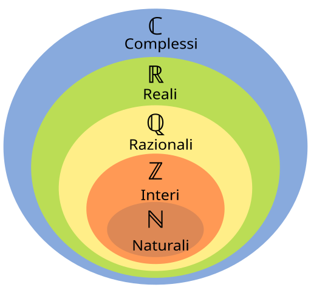
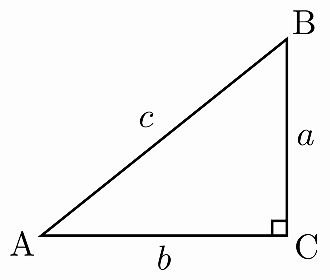

# Complex numbers background

  Complex numbers are a necessary part of math which allows to give a solution to equations of the form
  
  $x = \sqrt{- n} \notin R$ 
  $->$ 
  $x = \sqrt{- n} = i\sqrt{n} = Im(\sqrt{n}) \in C$

  where $n > 0 \in R$.
  
  Since this calculation doesn't follow $R$ field rules, another field is necessary to operate on these numbers, and guess what it's the complex field $C$. Now to avoid writing a book about fields math concepts: a field is a set of numbers, where an identity element exists, where every element (number) of the field has an inverse, and where two operations exist $(+, \times)$ and have some properties. We don't care about every single property of a field, what I want to say now is that the basic operations in $C$ behave differently compared to $R$. The interesting fact is that the equation above alone builds an entire field around itself. 
  Now before proceeding, I want to clarify one thing: the complex field is often associated to the $3rd$ dimension of the cartesian graph. There exist some tools [https://hemisemidemipresent.github.io/complex/] which help figuring out the three-dimensionality built by the complex field, since it often coexist with the two-dimensional cartesian graph $/R$ field in many functions/equations. Indeed the complex field "plane" share the $x-axis$ with the cartesian graph $/R$. But note that this doesn't necessarily mean that we are talking about dimensions. As humans we are dependent on visualize things graphically, but math is nothing but logic relations about quantities. If you think about the $C$ field as "another dimension" you are probably not right. Indeed $C$ **extends** $R$, and allows to operate on complex numbers, nothing more, nothing less. Math research permits to describe new logic behaviours about quantities which in turn permit to solve other problems. To conclude, don't stick too much on the dimensions, even though having a look at the above link could be useful.

## Representation and multiplication of numbers in $C$

  Since

  $n > 0, \sqrt{- n} = i\sqrt{n}$ 
  $->$ 
  $(\sqrt{- n})^{2} = - n = (i\sqrt{n})^{2} = i^{2}(\sqrt{n})^{2}$

  it must be that

  $i^{2} = i \cdot i = - 1$

  When we deal with the cartesian graph, every point mapped on it can be represented using this form:

  $(x_{?}, y_{?})$

  We can notice that this representation is the same as $x_{?} + y_{?}$, indeed this form is called "algebraic". Now since (as already mentioned) $C$ field shares $x-axis$ with $R$, infact $C$ is an **extension** of $R$ (as shown above into the Euler-Venn graph), we can represent complex numbers as sitting on an orthogonal to $R$ plane (see the link above and play around, this is why I told you that it could be useful to visualize it). This reasoning is to "justify" the presence of a "real" part in the $C$ field. To better understand this fact, the following are the 2D (Re, and Im) **and** 3D representation of $y = \sqrt{x}$ function

  

  which as you can see is not defined when $n < 0$ since $\sqrt{n} \notin R$ for $n$ negative, while

  

  is exactly the same function but it is defined in $C$, indeed $n < 0, \sqrt{n} = i\sqrt{n} \in C$. 
  Now let's see the 3D representation, always noting that these results are somehow biased from the obvious complexity of such 
  software and the forced $3rd-person$ POV.

  

  Now, since we know why the $x-axis$ is shared between $R$ and $C$, and we can represent any number in an "algebraic" form:

  $z = (x, y) = x + y$ with $z, x, y \in R$ 
  
  is the representation of any number on the $R-plane$ part of the cartesian graph, while
  
  $z = (x, Im(y)) = x + Im(y)$ with $z, Im(y) \in C, x, y \in R$ 
  
  is the representation of any number on the $C-plane$ part of the cartesian graph.

  Now we can further observe a couple of complex numbers graphical representation in a clearer representation of the $C$ plane.

  $z_1 = 1 + Im(1)$ 
  $z_2 = - 3 - Im(2)$

  

  Now we can finally see the multiplication.

  $z_{1} = (x_{1}, Im(y_{1})) = x_{1} + Im(y_{1}) = x_{1} + iy_{1}$ 
  $z_{2} = (x_{2}, Im(y_{2})) = x_{2} + Im(y_{2}) = x_{2} + iy_{2}$
  
  $(x_{1}, Im(y_{1})) \cdot (x_{2}, Im(y_{2})) = (x_{1} + iy_{1})(x_{2} + iy_{2}) = x_{1}x_{2} + x_{1}iy_{2} + iy_{1}x_{2} + (- 1)y_{1}y_{2} = x_{1}x_{2} - y_{1}y_{2} + i(x_{1}y_{2} + y_{1}x_{2}) = (x_{1}x_{2} - y_{1}y_{2}, x_{1}y_{2} + y_{1}x_{2})$
 

## Complex divison using algebraic form

  
  We can make a little trick to avoid $i$ in the denominator and have a more readable general form for divison.

  $\displaystyle \frac{z_1}{z_2} = \frac{x_1 + iy_1}{x_2 + iy_2} = \frac{x_1 + iy_1}{x_2 + iy_2} \cdot \frac{x_2 - iy_2}{x_2 - iy_2} = \frac{(x_1 + iy_1)(x_2 - iy_2)}{x_2^2 + y_2^2} = \frac{x_1x_2 + y_1y_2 + i(x_2y_1 - x_1y_2)}{x_2^2 + y_2^2} = \frac{x_1x_2 + y_1y_2}{x_2^2 + y_2^2} + i\frac{x_2y_1 - x_1y_2}{x_2^2 + y_2^2}$
  

## Tigonometric shape of complex numbers

  Some basic knowledge of trigonometry enables us to represent complex numbers in a quite intuitive form which only involves the length of $z$ segment, and the $\sin$ and $\cos$ functions, which in turn is the exact same of the "algebraic" form.

  If you don't remember radians values for angles I give you a quick remainder. The circumference of a circle of radius $r = 1$ is given by

  $C = 2 \pi r$

  (because $\pi = C / 2r$).

  This means that we can represent the round angle ($360°$) $\theta$ as $(r = 1)$

  $\theta = 2\pi$

  and every other angle follows, then if
  
  $\theta = 180°$ 
  $->$ 
  $\theta = \pi$

  $-----$

  $\theta = 90°$ 
  $->$ 
  $\displaystyle \theta = \frac{\pi}{2}$

  and so on. We can safely set $r = 1$ as angles are not affected by the length of the radius, indeed it's clear that radians are the true representation of angles.

  Now, back to our complex numbers, since

  $z = x + Im(y) = x + iy$
  
  we can define $z \in C$ as

  $z = \sqrt{x^{2} + y^{2}}\cos(\theta) + \sqrt{x^{2} + y^{2}}i\sin(\theta)$

  where $\theta$ is the angle in the middle of the $z$ segment and the $x-axis$, and $\sqrt{x^{2} + y^{2}}$ is basically the formula derived by the Pythagorean Theorem which calculates the hypothenuse of a triangle, which in our case is exactly the $z$ segment, and for which you can find an intuitive graphical proof at [https://it.wikipedia.org/wiki/Teorema_di_Pitagora] (just watch the images). Now, calling

  $|z| = \sqrt{x^{2} + y^{2}}$ 
  $->$ 
  $z = |z|\cos(\theta) + |z|i\sin(\theta)$ 
  $->$ 
  $z = |z|(\cos(\theta) + i\sin(\theta))$

  we basically derived our trigonometric form for any complex number $z$, for which you can find a graphical representation below.

  

  Since angles repeat themselves with a period of $k(2\pi), k \in Z$ we have that

  $z_1 = z_2$

  iff

  $|z_1| = |z_2|$ 
  $and$ 
  $\theta_1 = \theta_2 + k(2\pi), k \in Z$

## Trigonometric multiplication

  $z_1z_2 = |z_1|(\cos(\theta_1) + i\sin(\theta_1))|z_2|(\cos(\theta_2) + i\sin(\theta_2))$ 
  $=$ 
  $|z_1||z_2|(\cos(\theta_1)\cos(\theta_2) + i\cos(\theta_1)\sin(\theta_2) + i\sin(\theta_1)\cos(\theta_2) - \sin(\theta_1)\sin(\theta_2))$ 
  $=$ 
  $|z_1||z_2|(\cos(\theta_1)\cos(\theta_2) - \sin(\theta_1)\sin(\theta_2) + i(\cos(\theta_1)\sin(\theta_2) + \sin(\theta_1)\cos(\theta_2)))$ 

  Now we need to make a deviation into trigonometry in order to further simplify this last equation.

  $-----$

### $cos(\theta_1 + \theta_2) = \cos(\theta_1)\cos(\theta_2) - \sin(\theta_1)\sin(\theta_2)$

#### Proof

Consider the following picture.

We have

$A\hat{O}C = \alpha$ 
$A\hat{O}D = \beta$ 
$C\hat{O}D = \alpha - \beta$

and

$A = (\cos(0), \sin(0)) = (1, 0)$ 
$B = (\cos(\alpha - \beta), \sin(\alpha - \beta))$ 
$C = (\cos(\alpha), \sin(\alpha))$ 
$D = (\cos(\beta), \sin(\beta))$

Here I want to open a little parenthesis on $A$. I specified $A = (\cos(0), \sin(0))$ because this theorem is built on $\sin$ and $\cos$ relations and not exactly on the previous picture where $A$ sits on $(1, 0)$ because of the radius. The fact things must have sense graphically is often a problem in math, because math is invisible. The whole structure of computing distances below is by math means only a transformation of numbers which match a logic. The logic we have is about distances we see on the picture, but this theorem is really just about relations about $\sin$ and $\cos$, the intuition below about $\overline{AB} = \overline{CD}$ is just a god hint. I said this whole stuff because this theorem is not related with the length of the radius, that is, it works for any radius, hence the hypothesis of $r = 1$, doesn't really exist. So don't think at $A$ like the point you see, but as the virtual point of coordinates $(\cos(0), \sin(0))$.

Since

$A\hat{O}B = C\hat{O}D = \alpha - \beta$ 
$->$ 
$\overline{AB} = \overline{CD}$

and

$\overline{AB} = \sqrt{(\cos(\alpha - \beta) - 1)^{2} + (\sin(\alpha - \beta) - 0)^{2}}$ 
$\overline{CD} = \sqrt{(\cos(\alpha) - \cos(\beta))^{2} + (\sin(\alpha) - \sin(\beta))^{2}}$

where the last two formulas are just the basic formula to compute the distance between two points in the cartesian graph (note that the order of minuend and subtrahend doesn't matter since the difference is squared). Now since $\overline{AB} = \overline{CD}$

$\sqrt{(\cos(\alpha - \beta) - 1)^{2} + (\sin(\alpha - \beta) - 0)^{2}} = \sqrt{(\cos(\alpha) - \cos(\beta))^{2} + (\sin(\alpha) - \sin(\beta))^{2}}$ 
$->$ 
$(\cos(\alpha - \beta) - 1)^{2} + (\sin(\alpha - \beta) - 0)^{2} = (\cos(\alpha) - \cos(\beta))^{2} + (\sin(\alpha) - \sin(\beta))^{2}$ 
$->$ 
$\cos^{2}(\alpha - \beta) - 2\cos(\alpha - \beta) + 1 + \sin^{2}(\alpha - \beta) = \cos^{2}(\alpha) - 2\cos(\alpha)\cos(\beta) + \cos^{2}(\beta) + \sin^{2}(\alpha) - 2\sin(\alpha)\sin(\beta) + \sin^{2}(\beta)$ 

Now we need to further analyze the fundamental relation of trigonometry.

$-----$

### $\cos^{2}(\theta) + \sin^{2}(\theta) = 1$

#### Proof

Let $ABC$ be a right triangle with hypothenuse $\overline{AB}$ and right angle $A\hat{C}B$.

$

The only subtle intuition is to understand that

$\displaystyle \sin(B\hat{A}C) = \frac{\overline{BC}}{\overline{AB}}$

and not just $\overline{BC}$. It could be strange at first because in general we are used to reason on a circumference of radius $1$ where $\sin(B\hat{A}C)$ would be exactly $\overline{BC}$, but the truth is that $\sin$ and $\cos$ are relations between quantities (in this case lengths), indeed $\sin(B\hat{A}C) = 1$ only if the length of the segment we identified as $\overline{BC}$ is equal to $\overline{AB}$ (which would destroy the structure of the triangle but that's not the point here, indeed $\sin(90°)$ still equals $1$ after this revelation), and when we reason having a radius which equals $1$, we have

$\displaystyle \sin(B\hat{A}C) = \frac{\overline{BC}}{1} = \overline{BC}$

which clarifies why this 'theorem' could be strange at first. I used quotes because this equality strictly derives by the meaning of $\sin$ and $\cos$ functions, there are not complex formulas or steps involved. Having said so, we have

$\displaystyle \sin(B\hat{A}C) = \frac{\overline{BC}}{\overline{AB}}$ 
$\displaystyle \cos(B\hat{A}C) = \frac{\overline{AC}}{\overline{AB}}$

then

$\displaystyle \sin^2(B\hat{A}C) = \frac{\overline{BC}^2}{\overline{AB}^2}$ 
$\displaystyle \cos^2(B\hat{A}C) = \frac{\overline{AC}^2}{\overline{AB}^2}$ 
$->$ 
$\displaystyle \sin^2(B\hat{A}C) + \cos^2(B\hat{A}C) = \frac{\overline{BC}^2}{\overline{AB}^2} + \frac{\overline{AC}^2}{\overline{AB}^2} = \frac{\overline{BC}^2 + \overline{AC}^2}{\overline{AB}^2}$ 

and by the Pythagorean Theorem we exactly have that

$\overline{BC}^2 + \overline{AC}^2 = \overline{AB}^2$

then

$\displaystyle \frac{\overline{BC}^2 + \overline{AC}^2}{\overline{AB}^2} = 1$

and therefore

$\cos^{2}(\theta) + \sin^{2}(\theta) = 1$

always, for any $\theta$.

$-----$

Back to our previous theorem we had

$\cos^{2}(\alpha - \beta) - 2\cos(\alpha - \beta) + 1 + \sin^{2}(\alpha - \beta) = \cos^{2}(\alpha) - 2\cos(\alpha)\cos(\beta) + \cos^{2}(\beta) + \sin^{2}(\alpha) - 2\sin(\alpha)\sin(\beta) + \sin^{2}(\beta)$

then by the fundamental relation of trigonometry we have

$\cos^{2}(\alpha - \beta) + \sin^{2}(\alpha - \beta) = 1$ 
$\cos^{2}(\alpha) + \sin^{2}(\alpha) = 1$ 
$\cos^{2}(\beta) + \sin^{2}(\beta) = 1$

thus

$\cos^{2}(\alpha - \beta) - 2\cos(\alpha - \beta) + 1 + \sin^{2}(\alpha - \beta) = \cos^{2}(\alpha) - 2\cos(\alpha)\cos(\beta) + \cos^{2}(\beta) + \sin^{2}(\alpha) - 2\sin(\alpha)\sin(\beta) + \sin^{2}(\beta)$ 
$->$ 
$2 - 2\cos(\alpha - \beta) = - 2\cos(\alpha)\cos(\beta) - 2\sin(\alpha)\sin(\beta) + 2$ 
$->$ 
$2\cos(\alpha - \beta) = 2\cos(\alpha)\cos(\beta) + 2\sin(\alpha)\sin(\beta)$ 
$->$ 
$\cos(\alpha - \beta) = \cos(\alpha)\cos(\beta) + \sin(\alpha)\sin(\beta)$

Now

$\cos(\alpha + \beta) = \cos(\alpha - (- \beta))$ 
$->$ 
$\cos(\alpha - (- \beta)) = \cos(\alpha)\cos(- \beta) + \sin(\alpha)\sin(- \beta)$

Now it's quite simple to see that

$\cos(- \beta) = \cos(\beta)$ 
$\sin(- \beta) = - \sin(\beta)$

then

$\cos(\alpha - (- \beta)) = \cos(\alpha)\cos(- \beta) + \sin(\alpha)\sin(- \beta)$ 
$->$ 
$\cos(\alpha + \beta) = \cos(\alpha)\cos(\beta) - \sin(\alpha)\sin(\beta)$ _

which finally proves the theorem.

Since we are on the subject, let's prove

$\sin(\alpha + \beta) = \sin(\alpha)\cos(\beta) + \cos(\alpha)\sin(\beta)$

too.

$\cos(\alpha - \beta) = \cos(\alpha)\cos(\beta) + \sin(\alpha)\sin(\beta)$ 
$->$ 
$\alpha = 90° - \alpha$ 
$->$ 
$\cos((90° - \alpha) - \beta) = \cos(90° - \alpha)\cos(\beta) + \sin(90° - \alpha)\sin(\beta)$ 
$---$ 
$\cos((90° - \alpha) - \beta) = \cos(90° - \alpha - \beta) = \cos(90° - (\alpha + \beta)) = \sin(\alpha + \beta)$ 
$---$ 
$\cos((90° - \alpha) - \beta) = \cos(90° - \alpha)\cos(\beta) + \sin(90° - \alpha)\sin(\beta)$ 
$->$ 
$\sin(\alpha + \beta) = \sin(\alpha)\cos(\beta) + \cos(\alpha)\sin(\beta)$ _

$-----$

Now we can finally reconnect with the complex multiplication. We had

$|z_1||z_2|(\cos(\theta_1)\cos(\theta_2) - \sin(\theta_1)\sin(\theta_2) + i(\cos(\theta_1)\sin(\theta_2) + \sin(\theta_1)\cos(\theta_2)))$ 

Since now we know that

$\cos(\alpha + \beta) = \cos(\alpha)\cos(\beta) - \sin(\alpha)\sin(\beta)$ 
$and$ 
$\sin(\alpha + \beta) = \sin(\alpha)\cos(\beta) + \cos(\alpha)\sin(\beta)$

$|z_1||z_2|(\cos(\theta_1)\cos(\theta_2) - \sin(\theta_1)\sin(\theta_2) + i(\cos(\theta_1)\sin(\theta_2) + \sin(\theta_1)\cos(\theta_2)))$ 
$->$ 
$|z_1||z_2|(\cos(\theta_1 + \theta_2) + i(\sin(\theta_1 + \theta_2)))$

## From Newton $e$ constant discovery to

#### Ex. $x^{2} - 1 = 0$

  $x^{2} - 1 = 0$ 
  $x^{2} = 1$ 
  $x = 1$ or $x = - 1$

  This is not a complex solution, since we don't have $x = \sqrt{- 1}$ but $\sqrt{x^{2}} = \pm \sqrt{1}$, and $x^{2} - 1 = 0$ equals:

  $(x - 1)[x - (- 1)] = (x - 1)(x + 1) = 0$

#### Ex. $x^{3} - 1 = 0$

  Now, let's look at why complex numbers are so fascinating:

  $x^{3} - 1 = 0$ 
  $(x - 1)(x^2 + x + 1) = 0$ 

  Here we know that $1$ is a solution for sure, but look at the other solutions:

  $x^2 + x + 1 = 0$

  Applying [ https://github.com/xyzhyn/Quadratic-formula-derivation ], we find:

  $\displaystyle x_{1} = \frac{- 1 + \sqrt{1^{2} - 4 \cdot 1 \cdot 1}}{2} = \frac{- 1}{2} + \frac{\sqrt{- 3}}{2}$

  $\displaystyle x_{2} = \frac{- 1 - \sqrt{1^{2} - 4 \cdot 1 \cdot 1}}{2} = \frac{- 1}{2} - \frac{\sqrt{- 3}}{2}$

  Hence the only way to break down $x^{3} - 1 = 0$ is:

  $\displaystyle (x - 1)[x - (\frac{- 1}{2} + \frac{\sqrt{- 3}}{2})][x - (\frac{- 1}{2} - \frac{\sqrt{- 3}}{2})]$

#### Ex. $x^{4} - 1 = 0$

  $x^{4} - 1 = 0$ 
  $(x - 1)(x^{3} + x^{2} + x + 1) = 0$ 
  $(x - 1)[(x + 1)(x^{2} + 1)] = 0$ 
  $(x - 1)(x + 1)(x^{2} + 1) = 0$ 

  We have $4$ solutions:

  $x = 1$ 
  $x = - 1$ 
  $x = \sqrt{- 1}$ 
  $x = - \sqrt{- 1}$

  indeed

  $x^{4} - 1 = (x - 1)(x + 1)(x - \sqrt{- 1})(x + \sqrt{- 1})$ 

 #### Ex. $x^{5} - 1 = 0$

 

   $x^{5} - 1 = 0$ 
   $(x - 1)(x^{4} + x^{3} + x^{2} + x + 1)$ 
   $(x - 1)(x - 1)(x + 1)(x - \sqrt{- 1})(x + \sqrt{- 1})$

   Here we can recon that it's not true that $x^{n} - 1 = 0$ has **always** $n$ solutions.
 

  

